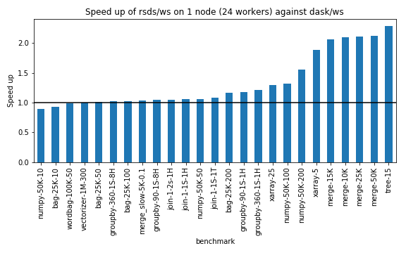
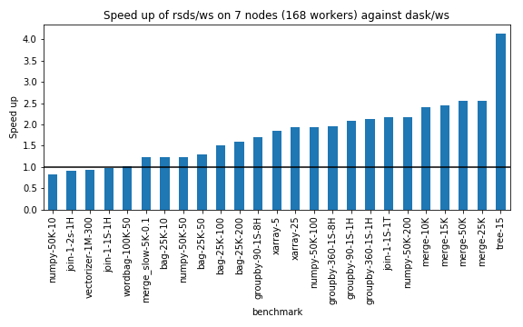

# rsds

``rsds`` is a Rust implementation of the [Dask/distributed](https://distributed.dask.org) central scheduler.
It is an experiment for evaluating the performance gain of a non-Python scheduler and for benchmarking different scheduling algorithms.

## Disclaimer
Dask/distributed has a very complex feature set and protocol and we do not support most of it.
Features like dashboard or custom communication protocols (UCX) and others are not supported.

If RSDS can run your use case, you could possibly see some speedup if the scheduler is the bottleneck
of your pipeline. If it isn't, it can be actually slower than Dask, since it uses much simpler scheduling
heuristics. YMMV.

If your pipeline cannot be run by rsds, feel free to send us an issue.

## Usage
First you need to install a modified version of Dask/distributed (currently it tracks Dask version 2.16.0):
```bash
$ pip install git+https://github.com/kobzol/distributed@simplified-encoding
```
The modifications that we had to perform to make it manageable to implement the Dask
protocol in Rust are described [here](https://github.com/dask/distributed/pull/3809).

Then compile RSDS:
```bash
$ RUSTFLAGS="-C target-cpu=native" cargo build --release
```

After that just use `target/release/rsds-scheduler` as you would use `dask-scheduler`.
Be wary that most of the command line options from `dask-scheduler` are not supported though.

## Benchmarks
You can find a set of benchmarks in the `script` folder. Here are some result of comparing `RSDS` and `Dask`
on 1/7 nodes with 24 workers each.





## Reports

* https://github.com/dask/distributed/issues/3139
